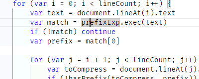
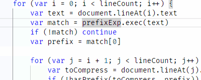
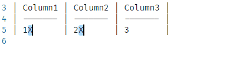

# Vertical Limit

Vertical Limit is a collection of commands to modify, select and navigate text blocks in order to unlock the full potential of working with multiple cursors.

## Features

### Cursor Navigation

Vertical Limit provides cursor navigation commands to:

- move to the first line of a block.
- move to the last line of a block.
- select text until the first line of a block.
- select text until the last line of a block.
- insert cursors until the first line of a block.
- insert cursors until the last line of a block.

- move cursor to begin of block.
- move cursor to end of block.
- extend selection to begin of block.
- extend selection to end of block.

### Enumerate

Vertical Limit provides a command to insert an enumeration in all active selections.

The user can provide:

- a starting number
- an incrementation step
- the minimal number of how many times an enumeration should be inserted
- a comma seperated alternativ list of enumerations

### Insert As Column

The command inserts each line in the clipboard with a prefix and postfix. The prefix and postfix is the text of the cursors line before and after the cursor. If there are multiple cursors in a line the cliboard line will be inserted for each cursor.

### Move Selection To New File

Vertical Limit provides a command to move the selected text into a new unsaved file.
For unsaved files Vertical Limit provides a command to cut all content into the clipboard and close the file.
This can be used to undo the Move Selection to new File into new File command.

## Glossary

### Block

A Block consists of line up text lines with the same indentation. Empty lines are consideres as indented by `-1` so that they seperate unindented lines.

### Move To Begin / End Of Block

The begin of a block is the first position inside the block.
If the cursor is already there it moves instead to begin of the first block with the same indentation inside the very next outer block.
If the cursor is already there it moves instead to begin of the very next outer block.
